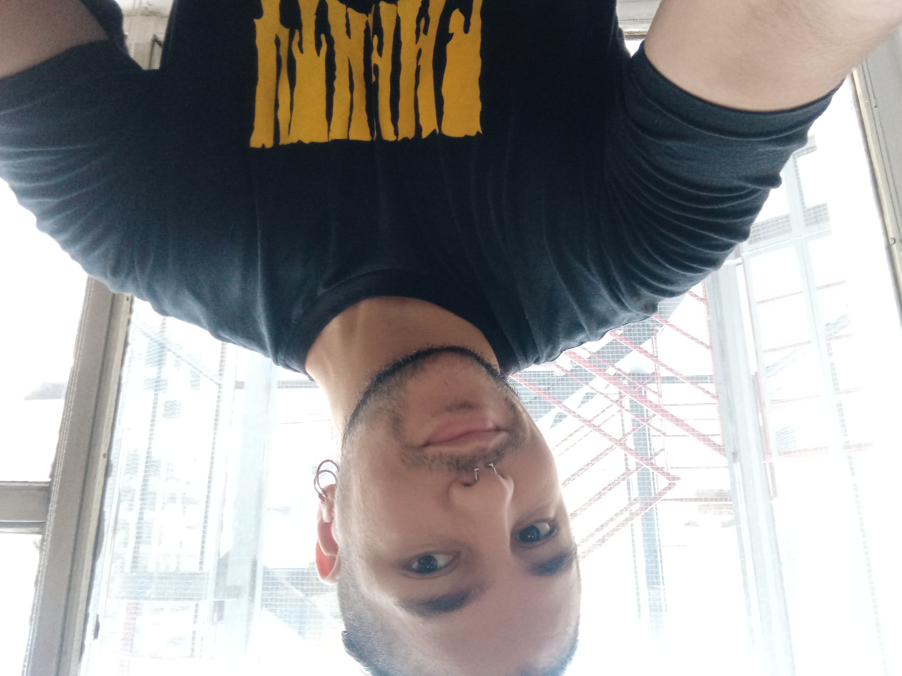

Bienvenidos a
# Programación con objetos I

En esta materia aprenderán sobre la famosa POO _(OOP en inglés)_, un paradigma que propone como base **objetos** que tienen un **estado** y **comportamiento**.
Para ello usaremos como herramienta el lenguaje Wollok.

```wollok
object programacionConObjetos { 
    method saludar() { 
        return  "Bienvenidxs!" 
    }
}
```

## Links importantes :monocle_face:
- [x] [Página principal](https://obj1-unahur.github.io/) de la materia (no olviden entrar seguido!) 
- [x] [Cronograma](https://docs.google.com/spreadsheets/d/1Ik6coqFm2lr2m6EFBGo3Ul4Bi4RPhrrtMQLbK3WcbIQ/edit?usp=sharing) de clases.
- [x] [Matricularse](https://discord.gg/tqyHtPt) y ver el canal de Discord.
- [x] [Mumuki](https://mumuki.io/unahur-obj1)

### Referencias Markdown 
* [Wikipedia](https://es.wikipedia.org/wiki/Markdown)
* [Guía Rápida](https://greg.schueler.us/doc/markdown.txt) de la sintaxis _(en inglés)_
* [Emojis!](https://github.com/ikatyang/emoji-cheat-sheet/blob/master/README.md) :sunglasses:

### Presentacion Personal

Me llamo Juan Manuel Solis Diaz , pero pueden decirme juanma o manu (o como quieran), tengo 25 años, vivo en Rafael Castillo con mi mujer y mi hijo. Estudio programacion de forma autotidacta desde el comienzo de la pandemia en 2020 y el año pasado ingrese a la UNAHUR. La programacion orientada a objetos es un paradigma que me gusta mucho asi que esta materia estoy seguro que la voy a transitar con muchas ganas y expectativa. 

Me gusta la musica , el futbol y la programacion

Me dedico a / Trabajo en el area de progrmacion de un equipo del indec donde estoy mas del lado del back.

Les dejo una imagen mía 


